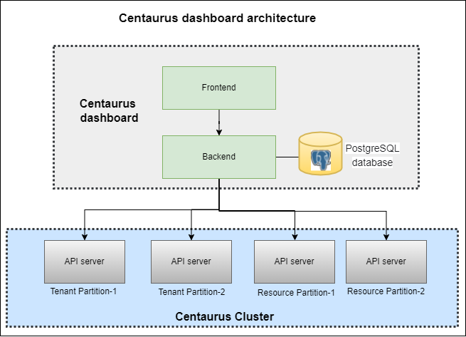
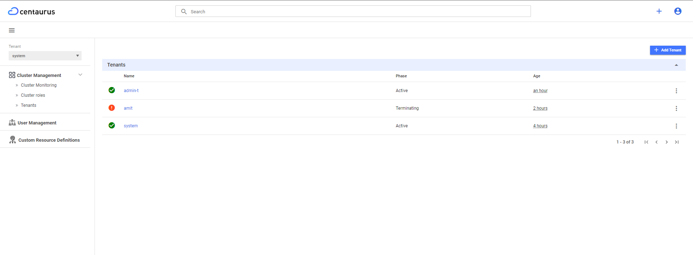
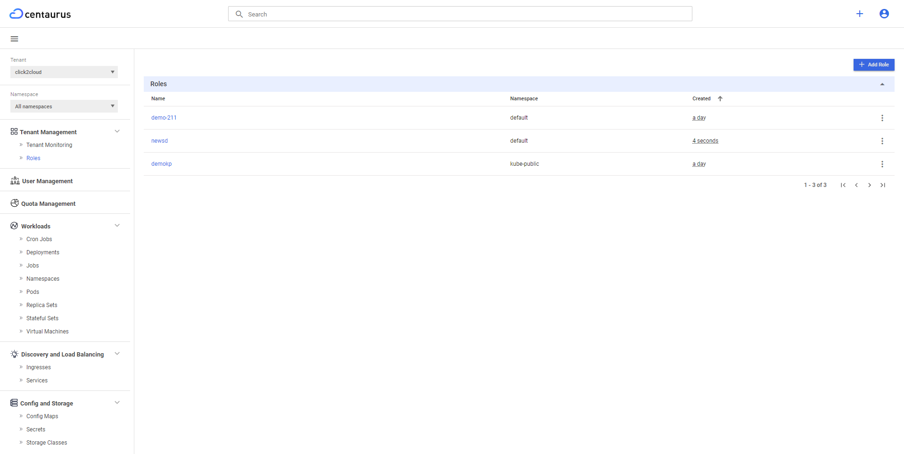
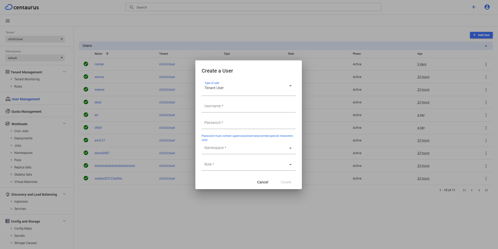
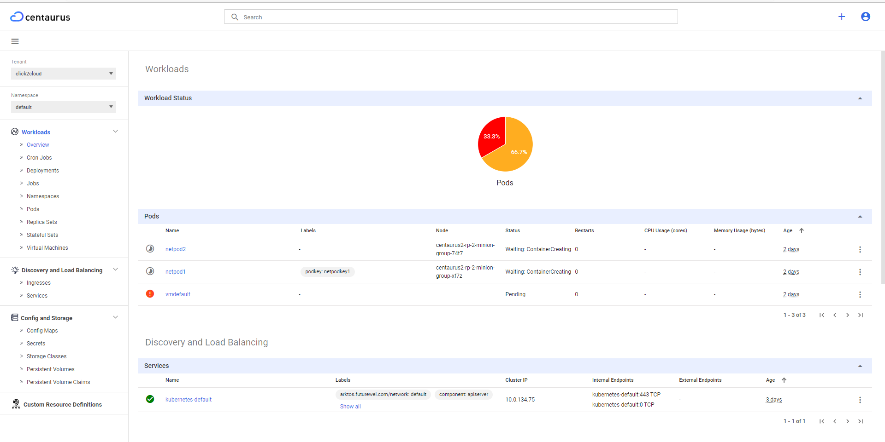
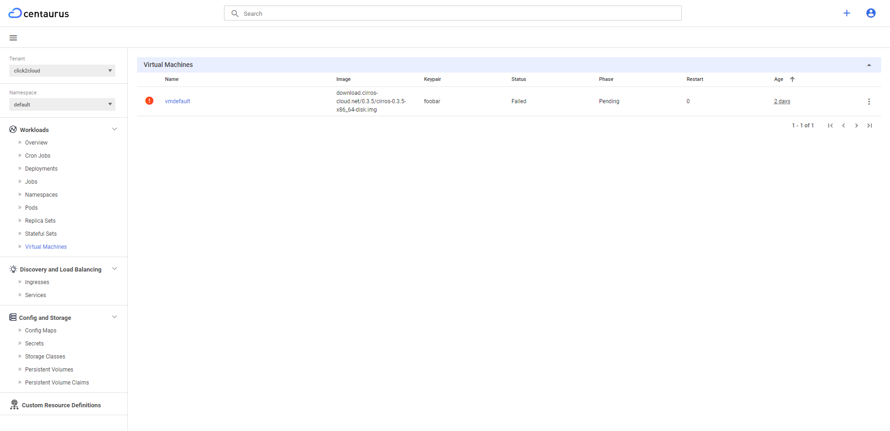

# Centaurus Portal Requirement & Design

This design document is a proposal for enhancing the dashboard UI that
allows users to manage Centaurus Cluster, Tenants, Users, and
Quotas in an intuitive way.

## Goals
* Manage Centaurus Cluster
* Manage multiple TPs and RPs using dashboard (by enabling client to fetch details from all TPs and RPs)
* Enable user to login using username and password (instead of token)
* Add tenant management feature
* Add user management feature
* Provide cluster monitoring (All TPs and RPs)
* Workload management (VM, Pods, Deployments, Services, etc)
* VM workload management
* Add quota management feature

## Background
Below details can be obtained by the cluster admin and tenant admin using CLI (i.e. using `kubectl` utility) :
* Tenant partition detail
* Resource partition detail
* Tenant Management
* Cluster role and role CRUD operation
* User Management
* Quota CRUD operation
* Namespace CRUD operation
* Role CRUD operation
* Cluster Monitoring
* VM workload management

None of these are reflected in the current version of Dashboard UI. User will need a simplified, more user-friendly way to manage the cluster, tenants, users and workloads.

## Overview

### Dashboard architecture

Centaurus dashboard has frontend(angular8), backend(golang) and database (PostgreSQL). backend service can send request to specific partition's api-server of Centaurus cluster (tested for 2TP and 2RP centaurus cluster).



### User Management
In centaurus, we will have 3 types of users i.e. Cluster admin, Tenant admin and Tenant user.
* **Cluster admin** can manage all type of users i.e. supported cluster admin, tenant admin and tenant users.
* **Tenant admin** can manage supported tenant admin and tenant users created under that particular tenant
* **Tenant user** can manage resources in a particular namespace.

* Centaurus cluster will have a default cluster admin(Username:`centaurus` and password: `Centaurus@123`) which will get created automatically while setting up dashboard service.

#### IAM service details
IAM service is a service that manages users, roles, and permissions.
This service will be used to manage Centaurus user's username and password which will get store in postgreSQL database.
Internally , IAM service will map a token to  username and password for a user.


To store user details, we have used database (PostgreSQL), with following attributes

Table name: **userdetail**

| Column    | Details                                                                    |
|---------|--------------------------------------------------------------------------|
| UserId     | Unique ID for each user            |
| Username     | User's name which can be used to login dashboard                          |
| Password  | Passoword which can be used to login dashboard                    |
| Token    | Token genenrated while user's creation                     |
| Type    |  It can be `cluster-admin`, `tenant-admin` or `tenant-user`|
| Tenant    | User's tenant name ( for supported cluster admin, it will be `system`     |
| Namespace | Namespace assigned to **Tenant-user** ( for others its value will be `default` |
| Role | Role name assigned to user |
| CreationTime    | User's creation time                                |

### Centaurus cluster management ( Support of using multiple config file of Centaurus cluster)
Earlier, dashboard was supporting single kube-config file or can connect to one api-server only. In centaurus cluster (n-TP and n-RP cluster), we have multiple config files (one for each Rp/TP). In this enhancement, dashboard service is modified to send request to multiple api-servers and manage resources.
It is assumed that kubeconfig file should have name in specific format (i.e. `kubeconfig.`+`rp/tp`+`-`+`tp/rp index`)

For example:
* For TP-1, it should be `kubeconfig.tp-1`
* For TP-2, it should be `kubeconfig.tp-2`
* For RP-1, it should be `kubeconfig.rp-1`
* For RP-2, it should be `kubeconfig.rp-2`

If user will install using ***kube-up*** script , then it creates config files in this format only, user will have to provide location of this files to dashboard service.
### Cluster admin profile
Cluster admin can perform following operation using Dashboard UI:
* Create tenant along with tenant admin
* Create tenant admin for any tenant
* Create supported cluster admin user
* Delete tenant
* List all tenant
* List any user
* Delete any user
* Get details of all tenant partition and resource partition
* Monitor health checks & resource utilization for each and every partition
* Create RBAC roles and role bindings
* Manage CRDs

#### Tenant Creation
When user will create a new tenant, dashboard service will create a tenant admin for that tenant with username and password provided by cluster admin user.

For 2 Tenant partition, all tenants' name starting with alphabet **a** to **m**, will get created in **Tenant partition-1(TP-1)** and all tenants's name starting with **n** to **z**, will get created in **Tenant partion-2(TP-2)**


Following YAML is being used to create Cluster admin
```bigquery
apiVersion: v1
kind: ServiceAccount
metadata:
  name: cluster-admin
  namespace: default
---
apiVersion: rbac.authorization.k8s.io/v1
kind: ClusterRoleBinding
metadata:
  name: cluster-admin
subjects:
  - kind: ServiceAccount
    name: cluster-admin
    namespace: default
    apiGroup: ""
roleRef:
  kind: ClusterRole
  name: cluster-admin
  apiGroup: rbac.authorization.k8s.io
```


### Tenant admin profile
Tenant admin is tenant scoped user, who can perform operations on specific tenant. Tenant admin can perform following operation using Dashboard UI:
* Create,List and Delete supported tenant admin user for that tenant
* Create and delete tenant user within that tenant
* Monitor health checks & resource utilization for its own respective tenant within the Centaurus cluster
* Namespace operation for that tenant
* Role operation for that tenant
* Manage namespace quotas for a tenant
* Manage resources within a tenant
* Manage CRDs within a tenant

Following YAML is being used to create tenant admin
```bigquery
apiVersion: v1
kind: Namespace
metadata:
  tenant: tenant-admin
  name: default
---
apiVersion: v1
kind: ServiceAccount
metadata:
  tenant: tenant-admin
  name: tenant-admin
  namespace: default
---
apiVersion: rbac.authorization.k8s.io/v1
kind: ClusterRole
metadata:
  tenant: tenant-admin
  name: tenant-admin
  namespace: default
rules:
  - apiGroups: ["*"]
    resources: ["*"]
    verbs: ["*"]
---
apiVersion: rbac.authorization.k8s.io/v1
kind: ClusterRoleBinding
metadata:
  name: tenant-admin
  tenant: tenant-admin
  namespace: default
subjects:
  - kind: ServiceAccount
    name: tenant-admin
    namespace: default
    apiGroup: ""
roleRef:
  kind: ClusterRole
  name: tenant-admin
  apiGroup: rbac.authorization.k8s.io
```


### Tenant user profile
Tenant user is namespace scoped user that can perform following operation using Dashboard UI:
* Application deployment within a namespace
* VM workload management within a namespace
* Monitoring and resource utilization according to RBAC

YAML for tenant user
```bigquery
apiVersion: v1
kind: Namespace
metadata:
  name: user-namespace
  tenant: tenant-name
---
apiVersion: v1
kind: ServiceAccount
metadata:
  name: tenant-user
  namespace: user-namespace
  tenant: tenant-name
---
apiVersion: rbac.authorization.k8s.io/v1
kind: RoleBinding
metadata:
  name: tenant-user
  namespace: user-namespace
  tenant: tenant-name
subjects:
  - kind: ServiceAccount
    name: tenant-user
    namespace: user-namespace
    apiGroup: ""
roleRef:
  kind: Role
  name: tenant-user
  apiGroup: rbac.authorization.k8s.io
```


### Dashboard client modification

Earlier dashboard go-client was able to connect to only one api-server of Arktos cluster, the modified dashboard client will be able to communicate to multiple api-server which allow dashboard service to fetch all details of all RPs and TPs.

Also, system is default tenant in tenant partition, with multiple TPs, cluster will have multiple system tenant. It is confusing for dashboard client to perform operations on particular system tenant of tenant partition. So, Added API calls which will include the tenant partition's name so that dashboard client will pick the correct system tenant for a particular tenant partition.

## Dashboard detailed Design

##### 1. Login Page
User will be able to login to dashboard using username and password.


##### 2. Cluster Monitoring

* List of all the partitions available

###### Enable multi-config support in dashboard client:

In centaurus cluster, for 2TP and 2RPs cluster, user will have 4 configs. So dashboard's client can connect to respective API server(respective TP) in which that tenant is located.
For eg. if we have 2TPs and 2RPs cluster, then all tenants with prefix between `a` to `m` will get created in TP1 and tenants with prefix between `n` to `z` will get created in TP2.


* Inside Resource Partition details, user will be able see the details of all nodes and resources


* Inside Tenant Partition details, user will be able see the details of all the tenants.




##### 3. Tenant Monitoring for tenant admin
* Tenant admin will be able to see the details of all the resources created within that tenant.


##### 4. Tenant Operation
***List Tenants***


***Create Tenant Admin operation***


##### 5. User Management

* List of all the users created


##### 6. Tenant admin overview page


##### 7. Managing Namespace
* List of all Namespaces created


##### 8. Access Control
***Roles and Cluster roles***




##### 9. Managing Quotas
* List of quotas for a tenant


* Tenant admin can manage quota for different namespaces within a tenant and also Tenant admin can update the quota assigned to a tenant


##### 9. Tenant User

* Create a new tenant user


* Tenant user overview page



* VM workload management



### Developement Portal Link

***Link***: [Centaurus Portal](https://35.193.138.94:30001/#/login)

***Username***: `centaurus`

***Password***: `Centaurus@123`
